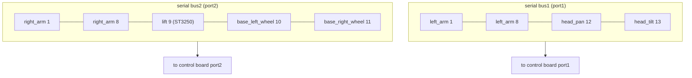
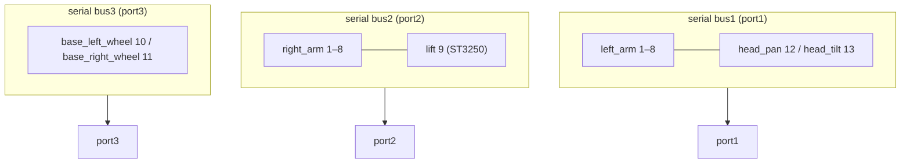

# HumanaOpen Assembly Guide

Step-by-step instructions to assemble a HumanaOpen robot. Chinese version:
[Assembly_zh.md](Assembly_zh.md).

# 1. Chassis Assembly

## (1) Mount the servo to the bracket

Fix the ST3215 C018 servo into the servo bracket (base) using the screws that
come with the servo.

Note: clear out the supporting structure inside the bracket.

## (2) Fix the servo bracket to the chassis

Use 8 pcs M3*22 screws to fix the ST3215 C018 servo base to the chassis.

## (3) Install the caster wheel on the chassis

Use 8 pcs M3*12 screws to fix the caster wheel to the chassis.

Note: pass the screws from bottom to top.

## (4) Install the drive wheel hubs

Slide the 37*30*4mm bearing onto the hub; the bearing should spin freely.

Mount the hubs onto the drive wheels using 8 pcs M3*12 screws and M3 washers
(add the M3 washers during installation).

## (5) Install the drive wheels

Use 10 pcs M3*25 screws to mount the drive wheels onto the chassis.

## (6) Set chassis servo IDs and connect servo cables

Use the FEETECH servo software to set the servo IDs: left wheel 10, right
wheel 11. Connect the servos with servo cables.

## (7) Install the chassis top cover

Pass the 500mm servo cable through the hole at the front of the top cover.

Snap on the cover and tighten with 24 pcs M3*20 self-tapping screws.

Flip the chassis over, insert the base, tighten with 8 pcs M3*22 self-tapping
screws, and route the servo cables out through the hole in the base.

# 2. Lift Axis Assembly

## (1) Install the lift servo mount

Use the FEETECH software to set the ST3250 servo ID to 9. Insert the servo into
the servo mount and tighten with screws.

Install the flange onto the servo shaft.

## (2) Install the lift axis

Use 4 pcs M3*10 screws to fix two graphite-copper bushings and the brass nut
that comes with the lead screw onto the lift axis connector.

Pass the 300mm lead screw through the brass nut.

Fix the bottom of the lead screw onto the coupling and tighten with a hex key.

Embed an 8 × 22 × 7mm bearing into the top printed part of the lift axis and
insert the two guide shafts into the top printed part.

Use 4 pcs M6*12 hex socket screws to fix the top and bottom of the aluminum
extrusion.

Plug the 500mm and 1000mm servo cables that come out from the bottom into the
ST3250 servo.

Use 8–16 pcs M5*22 screws to fix the inner printed part of the lift axis onto
the lift axis. Fix the assembled lift axis onto the base and tighten with 4 pcs
M3*20 self-tapping screws.

Route the 1000mm servo cable out through the right side inside the inner
printed part.

## (3) Install the lift axis outer rollers

Use 4 pcs M4*16 screws to fix 4 U-groove bearings onto the outer printed part
of the lift axis.

Fix the outer printed part of the lift axis onto the base.

# 3. Arm Assembly

## (1) Follower arm assembly

Use 16 pcs ST3215 C018 servos and printed parts to assemble the follower arms.

Follower arm, right:

Follower arm, left:

## (2) Leader arm assembly

Use 16 pcs ST3215 C046 servos and printed parts to assemble the leader arms.

Use 8 pcs M6*20 screws to fix the leader arms and the connector together, then
fix them onto the 3060 aluminum extrusion.

# 4. Body Assembly

## (1) Fix the arms

Use 8 pcs M6*22 screws to fix the arms onto the body.

## (2) Chest camera mount (optional)

Use 4 pcs M2*12 screws to fix the camera.

(3) Insert the body onto the lift axis and fix it with 4 pcs M3*10 self-tapping
screws.

# 5. Neck and Head Assembly

## (1) Joint assembly

Set the IDs of the two ST3215 C018 servos (12, 13), tighten them onto the neck
printed part with the screws that come with the servos, and daisy-chain them
with servo cables.

Use the screws that come with the servos to fix the neck onto the head.

## (2) Camera mount

Fix an RGB camera or a depth camera onto the head and connect the camera cable.

Use 2 pcs M3*20 screws to fix the neck onto the body.

# 6. Display Assembly

Use 4 pcs M3.5*8 screws to fix the display and its connector.

Insert the connector into the slot on the back.

# 7. Wiring

Put the dock and battery on the lower level, and the Raspberry Pi or Jetson on
the upper level. (1) Use a splitter Type-C-to-DC cable to connect the battery
(140W high-power port) and the arm control board to power the arms. (2) Use
another USB-to-DC / Type-C-to-DC cable to connect the battery and the Raspberry
Pi / Jetson. (3) Plug all the cameras directly into the Raspberry Pi or Jetson.

# 8. Finished Assembly

# 9. Servo IDs and Bus Wiring

## (1) Servo ID map

| ID | Motor | Model | Bus / Port |
|----|-------|-------|------------|
| 1–8 | Left arm (`left_arm_*`, 7-DOF + gripper) | ST3215 C018 | bus1 (`port1`) |
| 12 | Head pan | ST3215 C018 | bus1 (`port1`) |
| 13 | Head tilt | ST3215 C018 | bus1 (`port1`) |
| 1–8 | Right arm (`right_arm_*`, 7-DOF + gripper) | ST3215 C018 | bus2 (`port2`) |
| 9  | Lift (`lift_axis`) | ST3250 | bus2 (`port2`) |
| 10 | Base left wheel | ST3215 C018 | bus2 (`port2`) or bus3 |
| 11 | Base right wheel | ST3215 C018 | bus2 (`port2`) or bus3 |

> 2-bus mode (`port3=None`): the lift and wheels share bus2 with the right arm.
> 3-bus mode: the wheels move to bus3 (`port3`).

## (2) Wiring diagram (2-bus mode)

## (3) Wiring diagram (3-bus mode)

> Mermaid renders automatically on GitHub. If your viewer does not render it,
> refer to the servo ID map above for the same wiring relationship.