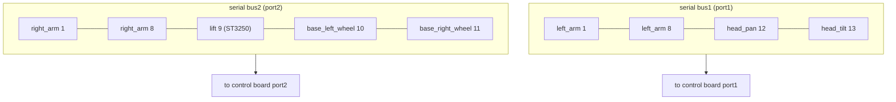
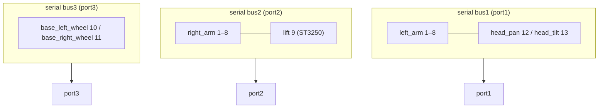

# Assembly Guide

Step-by-step instructions to build a HumanaOpen.

> Placeholder — fill in the actual build order, torque values, and refer to the
> images/CAD. Suggested subsystem breakdown below.

## Tools you need

- ...

## Build order (suggested)

1. **Frame / chassis** — assemble the body structure.
2. **Arms** — build left then right arm, mount the servos and attach the arm
   segments.
3. **Head** — mount the pan/tilt servos.
4. **Lift** — install the leadscrew lift assembly.
5. **Base** — mount the differential-drive wheels and motors.
6. **Electronics** — install the control board, cameras, and wiring
   (see [`electronics/wiring.md`](../electronics/wiring.md)).

> Always re-check the 12V supply wiring before powering on. See
> [`docs/`](../../docs/) for calibration after assembly.

## Servo & wiring overview

### Motor ID map

| ID | Motor | Model | Bus / port |
|----|-------|-------|------------|
| 1–8 | Left arm (`left_arm_*`, 7-DOF + gripper) | ST3215 C018 | bus1 (`port1`) |
| 12 | Head pan | ST3215 C018 | bus1 (`port1`) |
| 13 | Head tilt | ST3215 C018 | bus1 (`port1`) |
| 1–8 | Right arm (`right_arm_*`, 7-DOF + gripper) | ST3215 C018 | bus2 (`port2`) |
| 9  | Lift (`lift_axis`) | ST3250 | bus2 (`port2`) |
| 10 | Base left wheel | ST3215 C018 | bus2 (`port2`) or bus3 |
| 11 | Base right wheel | ST3215 C018 | bus2 (`port2`) or bus3 |

> 2-bus mode (`port3=None`): lift + wheels share bus2 with the right arm.
> 3-bus mode: wheels move to bus3 (`port3`).

### Wiring diagram (2-bus mode)

### Wiring diagram (3-bus mode)

> Mermaid renders automatically on GitHub. If your viewer does not render it,
> see the motor ID table above for the same wiring relationship.

## Notes

- Follow the CAD/STL orientation when gluing/screwing printed parts.
- Keep cables routed away from moving joints.
